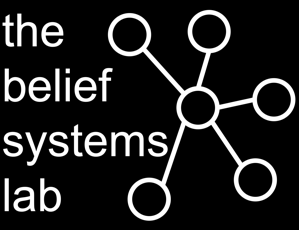

:::: {.hero-row}
::: {.hero-left}
{fig-alt="The Belief Systems Laboratory"}

```{=html}
<div class="hero-socials">
  <a href="mailto:m.j.brandt@tilburguniversity.edu" title="Email"><i class="bi bi-envelope-fill"></i></a>
  <a href="https://bsky.app/profile/mjbsp.bsky.social" title="Bluesky" target="_blank" rel="noopener"><i class="bi bi-bluesky"></i></a>
  <a href="https://www.linkedin.com/in/mark-brandt-4a7b30350/" title="LinkedIn" target="_blank" rel="noopener"><i class="bi bi-linkedin"></i></a>
</div>
```

::: {.lab-affil}
[Department of Social Psychology](https://www.tilburguniversity.edu/about/schools/socialsciences/organization/departments/social-psychology){target="_blank" rel="noopener"}\
[Tilburg University](https://www.tilburguniversity.edu){target="_blank" rel="noopener"}
:::
:::

::: {.hero-right}
Our goal is to understand the causes and consequences of political, religious, and moral beliefs that can ultimately be leveraged to reduce conflict and promote a more fair, just, and free society. We study ideological and moral beliefs — such as political ideology, racism, religious fundamentalism, and moral conviction — and how they structure attitudes and behaviors, how they become moralized, and why people adopt them in the first place.

Click here to learn about ways to [join the lab](join.qmd)!
:::

::::

## Projects {.lab-section}

::: {#project-listing}
:::

## Selected Publications {.lab-section}

A few recent papers. Check out [all of our publications](publications.qmd)!

```{r}
#| echo: false
#| results: asis
#| warning: false
#| message: false
source("_pubs.R")
print_pub_list(pubs_featured(load_pubs(), n = 5))
```
