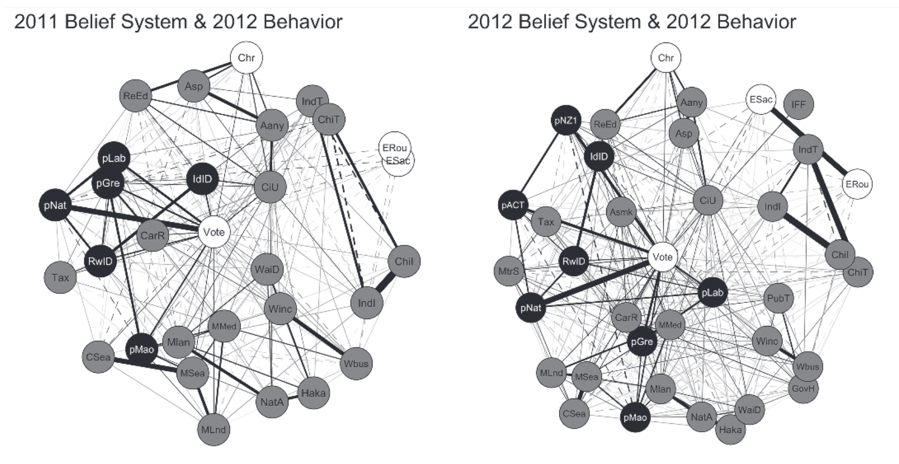

{.project-figure fig-alt="Figure 2 from Brandt, Sibley, & Osborne, 2019"}


The typical approach in the social psychology attitudes literature is to study one attitude at a time. However, our work on worldview conflict shows that people’s attitudes and values are interdependent. What happens when we treat an attitude at interdependent, rather than as a separate entity disconnected from other attitudes and values? Our research program on belief system dynamics does just this. In particular, We are testing how the connections between people’s attitudes and values – their belief systems – affect how attitudes develop and change. 

As a first step, we used a computational model and simulations to understand how interdependences affect attitude dynamics. The simulations implemented our idea that interconnected attitudes, values, and identities mutually influence each other. Moreover, our model assumes that each person can have their own uniquely structured belief system. The strength and structure of the connections between the attitudes and identities in these belief systems determines the dynamics of the attitudes in the belief system. The results of these simulations showed that our model accounted for several empirically known, but otherwise unrelated phenomena in the belief systems literature (e.g., attitude consistency, cross-pressures, spillover effects, partisan cues; Brandt & Sleegers, 2021). Our simulation approach is unique in social psychology. It is valuable because it shows that disparate findings from sociology, political science, and psychology, that are typically studied and conceptualized separately from one another, can be explained by the same set of psychological processes.  

Empirically, our lab documents the structure of people’s belief systems and how belief system structure is related to key outcomes (e.g. attitude change, belief extremity). Together, this work demonstrates that to understand attitude and value change, we need to understand the systems in which the attitudes and values are embedded. For example, the lab has found that liberals and conservatives have different moral value structure (Turner-Zwinkels, Sibley, Johnson, & Brandt, 2021) and that people’s political identities are particularly central to the organization of their political belief systems (Brandt et al., 2019; Turner-Zwinkels & Brandt, 2025). This belief system structure is consequential for attitude change. In one project, our team found that changing one attitude (the target attitude) can change other attitudes that are close in the belief system to the target attitude (Turner-Zwinkels & Brandt, 2022). In another project, we found that attitudes most and least central to the belief system are equally susceptible to persuasion (counter attitude theory; Brandt & Vallabha, 2025), but that least central attitudes spark less negative thoughts and emotions in reaction to persuasion attempts (consistent with attitude theory; Cassario, Vallabha, & Brandt, preprint).

Ongoing work is examining how individual-level belief system structure affects a wide range of attitude dynamics (using our validated measure, Brandt, 2022). For example, we conducted studies that used longitudinal designs to test if the structure of people’s belief systems affects the stability of attitudes. One finding we’ve replicated is that central attitudes to the belief system are more stable (Cassario, Vallabha, & Brandt, preprint). In related work, we are attempting to map the moralization of attitudes to the structure of the belief system, testing the idea that moralization “spills over” to connected attitudes in the system. Individual-level belief system structure has only recently been subject to empirical scrutiny (see Brandt, 2022) and so I am excited to see what else we can discover in this area!

## Related publications {.lab-section}

```{r}
#| echo: false
#| results: asis
#| warning: false
#| message: false
source("../_pubs.R")
print_pub_list(pubs_tagged(load_pubs("../pubs.csv"), "bsd"))
```
