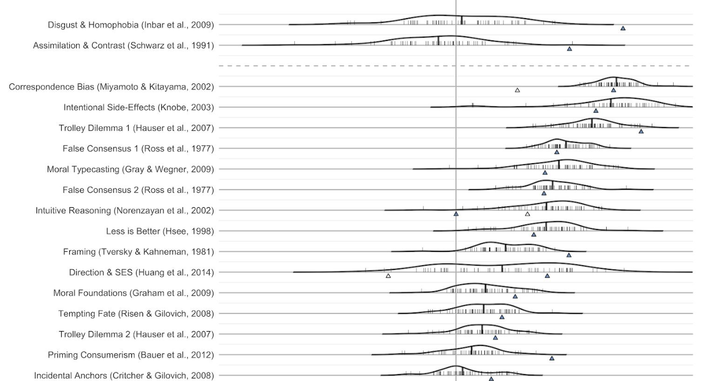

{.project-figure fig-alt="Figure 2, Klein et al., 2018"}


Psychological science, and social psychology in particular, has faced a number of challenges over the last several years. This includes failed replications, publication bias, underspecified theories, and a science that often ignores the perspectives of underrepresented and marginalized groups. To help address these shortcomings and move our science forward, my work aims to improve and document the replicability of our results, the robustness of our methods, and the quality of our theories.

The lab has contributed to these efforts in several ways. For example, we have published replications (e.g., Brandt, 2020) and developed guidelines for conducting high quality replications (Brandt et al., 2014). We have also contributed to (e.g., Klein et al., 2018) and lead (Brandt et al., 2020) a variety of large-scale projects that leverage data collection from around the world. A key part of a rigorous science is training the next generation of scientists to do rigorous work. Our contributions to CREP (e.g., Wagge et al., 2023) is one way to do that.

## Related publications {.lab-section}

```{r}
#| echo: false
#| results: asis
#| warning: false
#| message: false
source("../_pubs.R")
print_pub_list(pubs_tagged(load_pubs("../pubs.csv"), "improve"))
```
