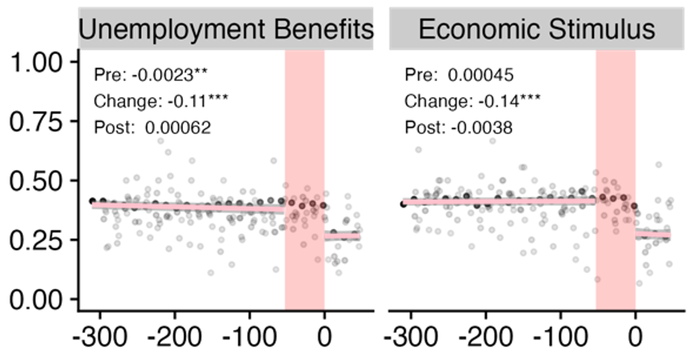

{.project-figure fig-alt="Figure S4 from Brandt et al."}


Adult political attitudes are highly stable (Brandt & Morgan, 2022; Turner-Zwinkels & Brandt, 2025), but they do change. What kinds of experiences cause attitude change? Do the same experiences change attitudes in the same way for everyone? Are experiences more impactful at certain points in our lives? How can be leverage life experiences to promote democratic resilience? These are the types of questions that we aim to answer in our  projects.  

## Related publications {.lab-section}

```{r}
#| echo: false
#| results: asis
#| warning: false
#| message: false
source("../_pubs.R")
print_pub_list(pubs_tagged(load_pubs("../pubs.csv"), "experiences"))
```
