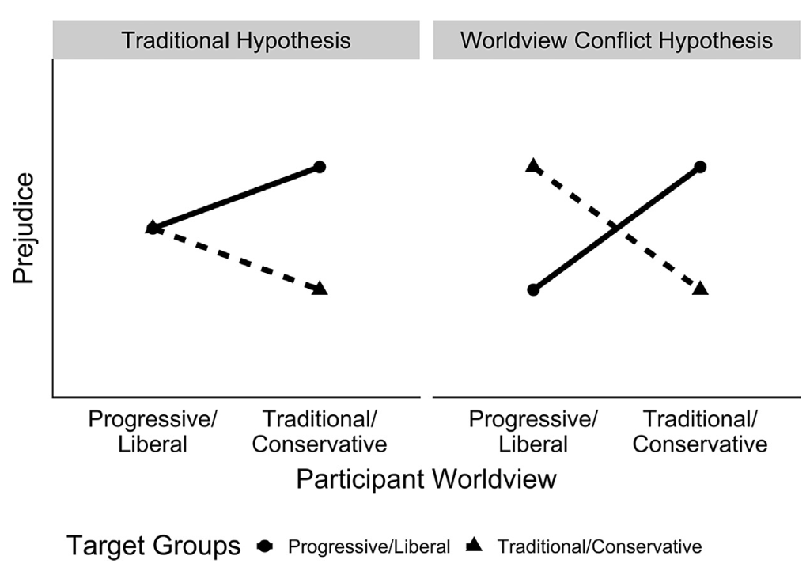

{.project-figure fig-alt="Figure 1 from Brandt & Crawford, 2020"}


The worldview conflict hypothesis (Brandt & Crawford, 2020) builds on the decades-old idea that people are motivated to defend their deeply cherished beliefs. Expressing animosity towards people and groups who do not share their beliefs is one method people use to defend their beliefs. We initially tested this idea in the political realm, finding that both liberals and conservatives express animosity towards groups who are seen as violating their moral values (e.g., Brandt, 2017; Brandt et al., 2014; Crawford, Brandt, et al., 2017; Wetherell, Brandt, & Reyna, 2013). We found similar results when we expanded to religion, finding that both the religious and non-religious express animosity towards groups who violate their moral values (e.g., Brandt & Van Tongeren, 2017; Van Tongeren, Kubin, Crawford, & Brandt, 2020). Crucially, although the targets of this animosity are meaningfully different, common psychological mechanisms of perceived worldview and value dissimilarity that account for group-based animosity cut across different strata of society.

This work is practically important because it suggests that to overcome the societal disfunction that comes with polarization, we need to understand how people perceive and cope with value differences. It is theoretically important because dominant models of political ideology and religiosity make a different prediction. They predict that people with more traditional belief systems are more likely to be express group-based animosity compared to people with more liberal or progressive belief systems. Scholars make this prediction because people with more traditional worldviews tend to be less open to experience and prefer more structure than people with more progressive worldviews. These individual differences should cause people with more traditional worldviews to express more animosity. Our work shows that these dominant models do not account for the data. Moreover, we find that even people high in openness also express animosity towards groups who violate their values (e.g., Brandt et al., 2015; Crawford & Brandt, 2019). Animosity towards people who violate our values appears to be a common psychological process.

Ongoing work is turning towards the reduction of worldview conflict. To this end, we've worked with Respectful Conversations, an organization that uses in-person trainings to help people confidentially and empathically discuss controversial issues, to evaluate their program (Brandt & Morey, preprint). We tested whether their program reduces animosity and increases respect for people with different perspectives on important community issues. We found that it does. One reason we think this may be happening is that this program teaches people to approach moral values with a sense of moral humility, a virtue we find is related to lower levels of political animosity (Vallabha & Brandt, preprint). We are currently exploring if large language models can be used to make respectful conversations more widely accessible.  

## Related publications {.lab-section}

```{r}
#| echo: false
#| results: asis
#| warning: false
#| message: false
source("../_pubs.R")
print_pub_list(pubs_tagged(load_pubs("../pubs.csv"), "wvc"))
```
